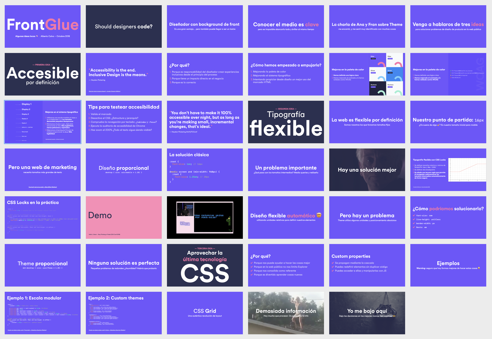

# Deckset theme for Cabify
A custom, on brand Cabify theme for [Deckset](https://www.deckset.com), an app to create super nice presentations with just Markdown.

Here‘s a real presentation I made so you can see an example of what you can achieve with this:

And [here’s the code](presentation-example/FrontGlue.md) I needed to create those slides. Simple, right? :)

## Features
- Forget about designing slides. Just focus in your content. Instantly change the look of your slides with simple markdown commands.
- Automatic syntax highlighting for code. Great for devs! :)
- Embed photos and videos easily
- Support for formulas
- Support for speaker notes, rehearsal mode, etc…
- [And many more…](https://www.deckset.com/features/)

## How to get started
1. [Get deckset](https://www.deckset.com/try/). There’s a free trial
2. [Download](https://drive.google.com/file/d/0B1GmWgd4p75-TmZwbjZQTFRGZjQ/view) and install Cabify Circular, our brand typeface
3. Install the [Cabify theme](theme/cabify-negative.dstheme)
4. [Here are some tips](https://www.deckset.com/help/tutorials/how-to-make-your-first-presentation.html) about how to make your first presentation with Deckset
5. If you want to dig deeper on how to do certain things in Deckset, they have a [nice documentation](https://docs.deckset.com/) for that

## Tips to make nice presentations
1. **Don’t bloat your slides with content**. Just focus in one idea, and do the rest by talking. Otherwise people will start reading and stop paying attention to what you’re saying
2. Take a look to [Convincing and influencing others](https://docs.google.com/presentation/d/1PUJdbr6u1hxTag7GEr9o0ZVuAIsF4mPoAlseVjh-kXY/edit#slide=id.g39c343f688_0_2136), a great talk David gave us a few months ago. There are some many great tips you can apply for your presentations
2. Use color wisely, to separate sections and highlight certain words. You can check [the example](presentation-example/FrontGlue.md) for some inspiration :)
