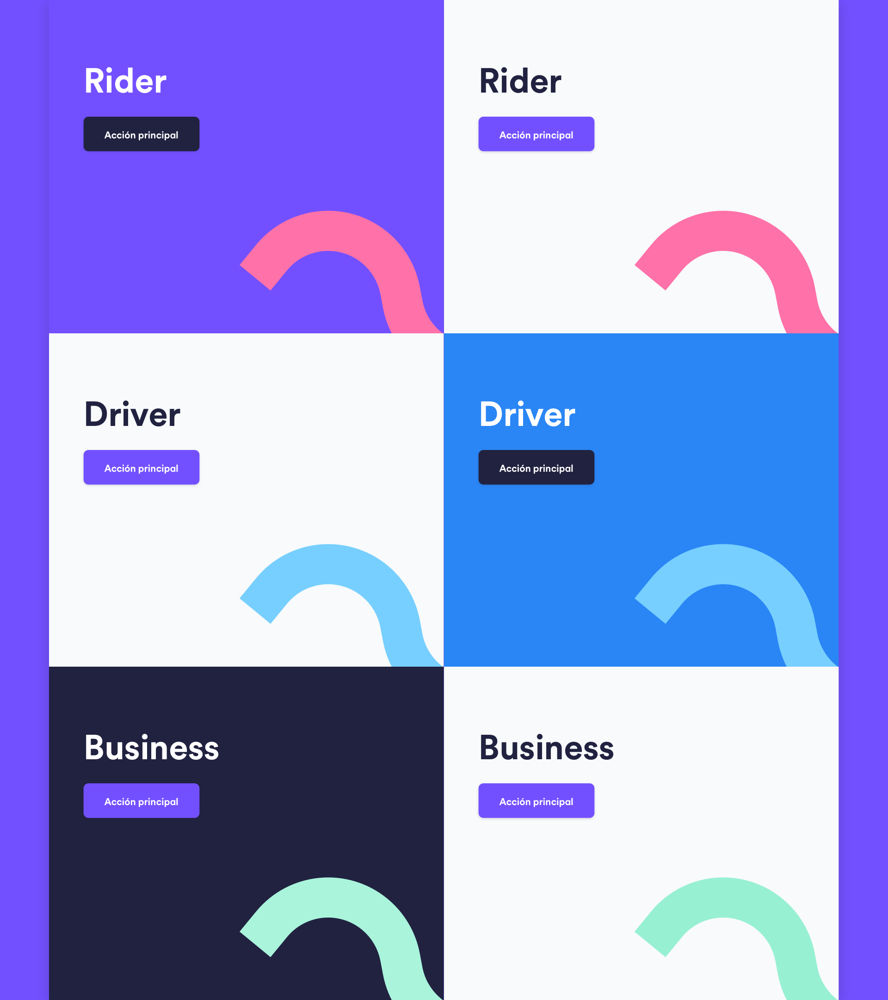
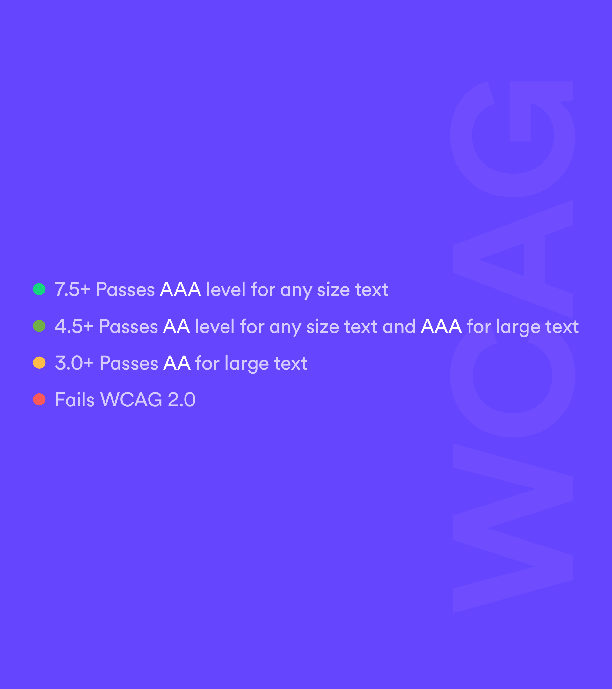
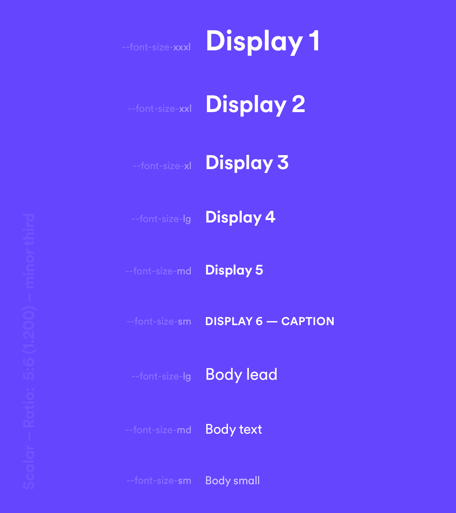
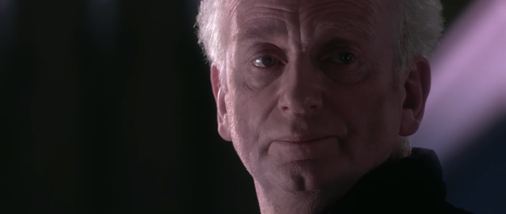
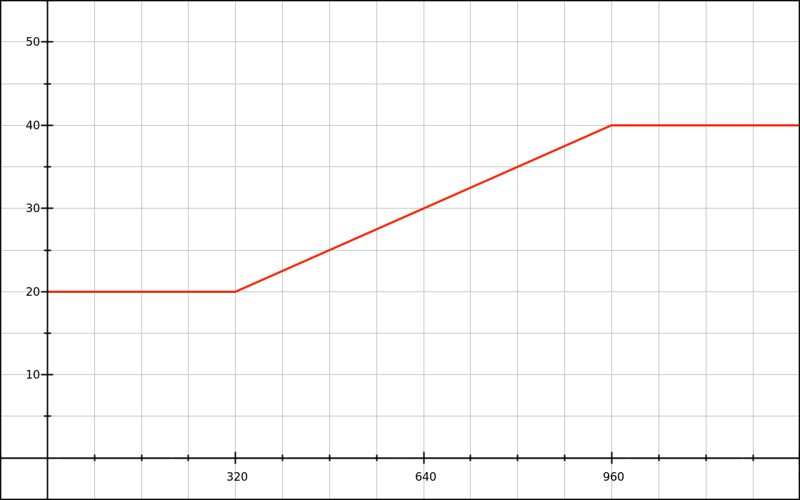
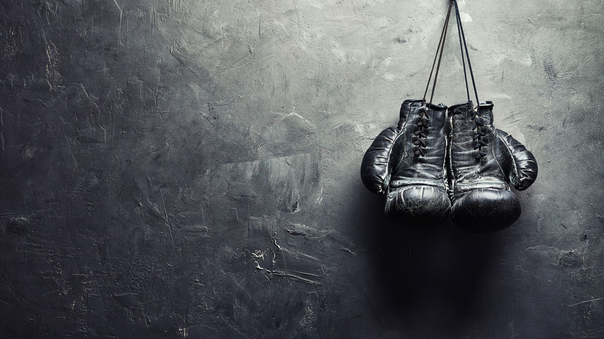

slidenumbers: false
autoscale: true

# <br>
# [Fit] Front**Glue**
# <br>
#### Algunas ideas locas 🦄 **·** *Alberto Calvo – Octubre 2018*

---
[.background-color: #212240]

### *Should designers* code?

---

### [Fit] Diseñador con background de front​​​​​​​​​​​​​​​​​​​ ​
#### *Es una gran ventaja… pero también puede llegar a ser un lastre*

---

### Conocer el medio es **clave**
#### *pero es imposible abarcarlo todo y brillar al mismo tiempo*

---

### [Fit] La charla de Ana y Fran sobre Theme
#### *me encantó, y me sentí muy identificado con muchas cosas*

---

### [fit] Vengo a hablaros de tres **ideas**  
#### *para solucionar problemas de diseño de producto en la web pública*

---

[.background-color: #212240]

#### **— PRIMERA IDEA —**
# [fit] Accesible
### *por definición*

---

> <br>
> “**Accessibility is the end.
> Inclusive Design is the means.**”
-- Heydon Pickering [^​​​​​​​​​]

[^​​​​​​​​​]: [What the Heck Is Inclusive Design? – Heydon Pickering (24Ways)](https://24ways.org/2016/what-the-heck-is-inclusive-design/)

---

[.header: #FFFFFF, alignment(left), CabifyCircular-Bold]

## <br>
## ¿Por qué?

1. *Porque es responsabilidad del diseñador crear experiencias inclusivas desde el principio del proceso*
2. *Porque tiene un impacto directo en el negocio*
3. *Porque es lo correcto*

---

[.header: #FFFFFF, alignment(left), CabifyCircular-Bold]

## <br>
## [Fit] ¿Cómo hemos empezado a empujarlo?

1. *Mejorando la paleta de color*
2. *Mejorando el sistema tipográfico*
3. *Intentando propiciar desde diseño un mejor uso del marcado HTML*

---



## <br>
## <br>
## [Fit] Mejoras en la paleta de color​​​​​​​​​​​​​​​​​​​ ​

1. **Hemos definido una lógica clara**
2. *Hemos mejorado el contraste y lo hemos validado contra WCAG*

---



## <br>
## <br>
## [Fit] Mejoras en la paleta de color​​​​​​​​​​​​​​​​​​​ ​

1. *Hemos definido una lógica clara*
2. **Hemos mejorado el contraste y lo hemos validado contra WCAG**

---



## <br>
## [Fit] Mejoras en el sistema tipográfico

1. *Utilizamos una escala modular en base a un multiplicador `1.2`:[^​​​​​​​​​​​​​​​​​​​​]* **Los tamaños demasiado pequeños desaparecen**
2. *Eliminamos el peso `light`, dejándolo únicamente en dos:*  **Más legibilidad, menos peticiones y repintados**
3. *Mejoramos el kerning de Circular de manera proporcional `-0.01em`:* **Más legibilidad**

[^​​​​​​​​​​​​​​​​​​​​]: [More Meaningful Typography – Tim Brown (A List Apart)](https://alistapart.com/article/more-meaningful-typography)

---

[.header: #FFFFFF, alignment(left), CabifyCircular-Bold]

## [fit] Tips para testear accesibilidad

1. *Valida el marcado*
2. *Desactiva el CSS: ¿Estructura y jerarquía?*
3. *Comprueba la navegación por teclado: ¿`tabindex` y `:focus`?*
4. *Ejecuta la auditoría de accesibilidad de Chrome*
4. *Haz zoom al 200% ¿Todo el texto sigue siendo visible?*

---

> “**You don’t have to make it 100% accessible over night, but as long as you’re making small, incremental changes, that’s ideal.**”
-- Heydon Pickering #a11yTOConf

---

[.background-color: #212240]

#### **— SEGUNDA IDEA —**
## *Tipografía* 
# [fit] flexible

---

### [fit] La web es flexible por definición
#### _Somos nosotros los que forzamos tamaños fijos_

---

### [fit] Nuestro punto de partida: `16px`
#### *¿Os suena de algo 💅? Es nuestro tamaño inicial para mobile*

---

[.footnote: alignment(center)]

### <br>
### Pero una web de marketing
#### *necesita tamaños más grandes de texto*[^​​​​​​​​​​​​​​​​​​​​​​​​​​​​​​​​]

[^​​​​​​​​​​​​​​​​​​​​​​​​​​​​​​​​]: [Your body text is too small – Xtian Miller (Medium)](https://blog.usejournal.com/your-body-text-is-too-small-5e02d36dc902)

---

### *Diseño* proporcional
#### `desktop { size: calc(mobile * 1.25) }`

---

[.header: #FFFFFF, alignment(left), CabifyCircular-Bold]

## La solución clásica

```scss
:root {
  font-size: 1em; // 16px
}

@media screen and (min-width: 960px) {
  :root {
    font-size: 1.25em; // 20px
  }
}
```

---

### Un problema importante
#### *¿Qué pasa con los tamaños intermedios? Media queries y rediseño*

---

[.background-color: #212240]



###  Hay una solución mejor

---



# <br>
# [Fit] Tipografía flexible con CSS Locks

1. *Se definen tamaños máximo y mínimo de tipografía: `16px` y `20px (125%)`*
2. *Se definen dos breakpoints*
3. **Se añade una tercera regla que permite al navegador redimensionar los tamaños intermedios automáticamente de forma segura** [^​​]
 
[^​​]: [The math of CSS Locks – Florens Verschelde (2016)](https://fvsch.com/css-locks/)

--- 

[.header: #FFFFFF, alignment(left), CabifyCircular-Bold]

## CSS Locks en la práctica

[.code-highlight: 8, 9]

```scss
:root {
  font-size: 1em; // Asuming 16px as the browser initial font size
}

// Small devices in landscape and above (360 × 576)
@media screen and (min-width: 22.5em) and (min-height: 36em) {
  :root {
    // Variable font size locking from a 16px minimum size to 20px at 1200px (our new grid size)
    font-size: calc(1em + .3333vmin); // ((20-16) / 1200) * 100 = 0.3333
  }
}

// Wide screens (1200 × 675) ~ 16:9 aspect ratio
@media screen and (min-width: 75em) and (min-height: 42.1875em) {
  :root {
    font-size: 1.25em; // Locking at 20px maximum 
  }
}
```

---

[.background-color: #FF71A9]
[.header: #212240, alignment(left), CabifyCircular-Book]
[.link: #212240]

## Demo[^​​​​]

[^​​​​]: [Keith J. Grant – Stop Thinking in Pixels (CSS Conf 2016)](https://youtu.be/XanhwddQ-PM)

---


---

### [fit] Diseño flexible **automático** 🤯
#### *utilizando unidades relativas para definir nuestros elementos*

---

### Pero hay un problema
#### *Theme utiliza algunas unidades y posicionamiento absolutos*

---

# <br>
# [Fit] ¿Cómo **podríamos** solucionarlo?

- *`font-size: rem`*
- *`line-height: unitless`*
- *`border-width: px`*
- *`Resto: em`*

---

### *Theme* proporcional
#### `mkt-desktop { size: calc(Theme * 1.25) }`

---

### [fit] Ninguna solución es perfecta
#### *Pequeños problemas de redondeo ¿Asumibles? Habría que probarlo*

---

[.background-color: #212240]

#### **— TERCERA IDEA —**
### Aprovechar la 
### **última tecnología**
# [fit] CSS

---
[.header: #FFFFFF, alignment(left), CabifyCircular-Bold]

# <br>
## ¿Por qué?

- *Porque nos puede ayudar a hacer las cosas mejor*
- *Porque en la web pública no nos limita Explorer*
- *Porque nos consolida como referente*
- *Porque es divertido aprender cosas nuevas*

---
[.header: #FFFFFF, alignment(left), CabifyCircular-Bold]

# <br>
## Custom properties

- *Se propagan mediante la cascada*
- *Puedes redefinir elementos sin duplicar código*
- *Puedes acceder a ellas y manipularlas con JS*

---

### Ejemplos
#### Warning: *seguro que hay formas mejores de hacer estas cosas 😅*

---

[.header: #FFFFFF, alignment(left), CabifyCircular-Bold]

## *Ejemplo 1:* Escala modular[^​​​​​​​​​​​​​​​​​​​​​​​​​​​​​​​​​​​​​​​​​​​​​​​​]

```scss
:root {
  --scalar: 1.200; // Ratio 5:6 – minor third

  --font-size-sm: calc(1 / var(--scalar) * 1rem); //0.833rem
  --font-size-md: 1rem;
  --font-size-lg: calc(var(--scalar) * 1rem); //1.2rem
  --font-size-xl: calc(var(--scalar) * var(--scalar) * 1rem); //1.44rem
  --font-size-xxl: calc(var(--scalar) * var(--scalar) * var(--scalar) * 1rem); //1.728rem
  --font-size-xxxl: calc(var(--scalar) * var(--scalar) * var(--scalar) * var(--scalar) * 1rem); //2.074em
}

// Wide screens (1200 × 675) ~ 16:9 aspect ratio
@media screen and (min-width: 75em) and (min-height: 42.1875em) {
   :root {
     --scalar: 1.333; // Ratio 3:4 – perfect fourth
  }
}
```

[^​​​​​​​​​​​​​​​​​​​​​​​​​​​​​​​​​​​​​​​​​​​​​​​​]: [Create your design system, part 1: Typography – Sebastiano Guerriero (Medium)](https://medium.com/codyhouse/create-your-design-system-part-1-typography-7c630d9092bd)

---

[.header: #FFFFFF, alignment(left), CabifyCircular-Bold]

## *Ejemplo 2:* Custom themes[^​​​​​​​​​​​​​​​​​​​​​​​​​​​​​​​​​​​​​​​​​​​​​​​​​​​​​​​​​​​​​​​​​​​​​​​​​​​​​​​​​​​​​​​​​​​​​​​​]

```scss
:root {
  --background-color: var(--color-selago);
  // Text
  --color-text-primary: var(--color-text-dark-primary);
  --color-text-secondary: var(--color-text-dark-secondary);
  --color-text-tertiary: var(--color-text-dark-tertiary);
  // Accent
  --color-accent-primary: var(--color-moradul);
  --color-accent-secondary: var(--color-pink);
}

.themeNegative {
  --background-color: var(--color-martinique);
  --color-text-primary: var(--color-text-light-primary);
  --color-text-secondary: var(--color-text-light-secondary);
  --color-text-tertiary: var(--color-text-light-tertiary);
}

.themeNegative.drivers {
  --background-color: var(--color-azura);
  --color-accent-primary: var(--color-martinique);
  --color-accent-secondary: var(--color-blue-love);
}
```

[^​​​​​​​​​​​​​​​​​​​​​​​​​​​​​​​​​​​​​​​​​​​​​​​​​​​​​​​​​​​​​​​​​​​​​​​​​​​​​​​​​​​​​​​​​​​​​​​​]: [Create your design system, part 3: Colors – Sebastiano Guerriero (Medium)](https://medium.com/codyhouse/create-your-design-system-part-3-colors-798e4729921f)

---

### *CSS* Grid
#### *Una auténtica revolución de layout*

---


###  Demasiada información
#### *Hay mucho que procesar. Os paso toda la info*

---

[.background-color: #212240]



###  Yo me bajo aquí
#### *Dejo las decisiones en las mejores manos:* las vuestras! 🙌